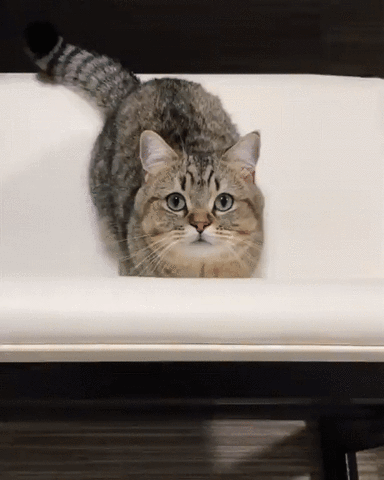

<h1 align="center">Hi 👋, I'm Nadiia Tkachenko</h1>

<h3 align="center">
Junior Front-End Developer | React | TypeScript | Next.js
</h3>

HTML5 • CSS3 • JavaScript • Responsive Development • WordPress • Elementor

Open to remote and on-site opportunities.

<table width="100%" >
<tr>

<td width="90%" valign="top">

Junior Front-End Developer who believes it's never too late to change your life and start building something new.

My path into software development began after nearly **five years as an Operating Room Nurse**. Moving to **Spain** inspired me to challenge myself, learn a completely new profession, and pursue a career in technology.

Today I combine **commercial WordPress experience**, **team collaboration**, and modern Front-End technologies including **React**, **TypeScript**, and **Next.js** to build responsive, user-friendly web applications.

I genuinely enjoy learning, solving real-world problems, and transforming ideas into clean, practical solutions.

Every project teaches me something new, and every commit brings me one step closer to becoming the developer I aspire to be.

 
    

 

</td>

<td width="10%" align="center" valign="middle">

 

<b>Debugging... 
Please wait 🐾</b>

</td>

</tr>
</table>

  

  

 (WordPress • Elementor)

- 🌍 **Carrocerías Usansolo** · [Live Website](https://carroceriasusansolo.com)

- 🌍 **Hamartop** · [Live Website](https://hamartop.bwdesarrollo3.es)

- 🌍 **Aroa Praiz Psicología** · [Live Website](https://aroapraizpsicologia.bwdesarrollo3.es)

<b>📝 NoteHub Next.js</b> &nbsp;•&nbsp;

&nbsp;&nbsp;
Modern note management application.
&nbsp;&nbsp;
<a href="https://06-notehub-nextjs-omega-jet.vercel.app/notes">🌍 Live Demo</a>
&nbsp;•&nbsp;
<a href="https://github.com/NadiiaUa23/06-notehub-nextjs">💻 GitHub</a>

<b>🎬 React Movies</b> &nbsp;•&nbsp;

&nbsp;&nbsp;
Movie search application using the TMDB API.
&nbsp;&nbsp;
<a href="https://03-react-movies-pi-nine.vercel.app">🌍 Live Demo</a>
&nbsp;•&nbsp;
<a href="https://github.com/NadiiaUa23/03-react-movies">💻 GitHub</a>

<b>🎮 Bee Brilliant Blast</b> &nbsp;•&nbsp;

&nbsp;&nbsp;
Responsive landing page built in a Front-End team.
&nbsp;&nbsp;
<a href="https://nadiiaua23.github.io/STP-12574/">🌍 Live Demo</a>
&nbsp;•&nbsp;
<a href="https://github.com/NadiiaUa23/STP-12574">💻 GitHub</a>

 |  | 

